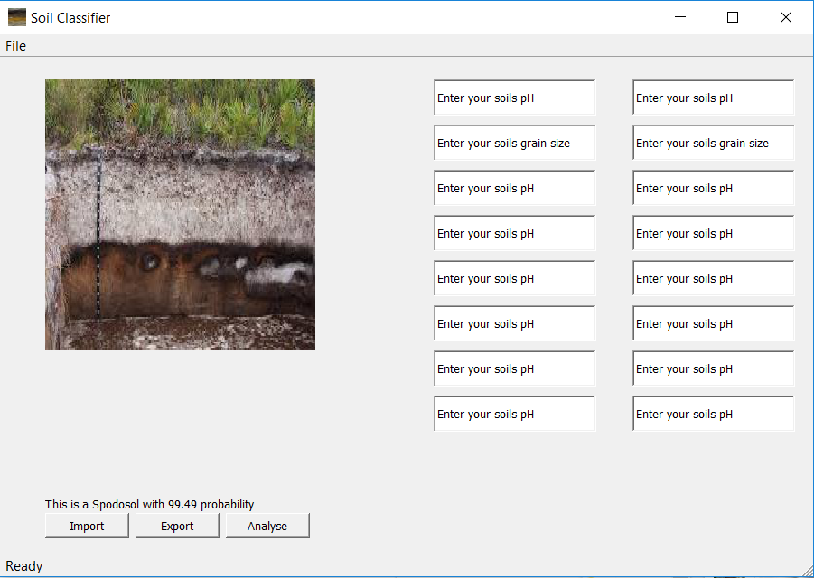

# Soil Classification Project

## Project for Soil Classification Utilising Convolutional Neural Networks

### Aim
The aim of this project is to classify different types of soil based on image recognition via convolutional neural networks (CNNs). They are to be classified into the 12 USDA soil classes and a 13th class which is all other images. The accuracy will also be improved by using supporting data on soil pH, texture and drainage which will be used to ensemble the CNN with a random forest algorithm.

### Data
The data used for the project comes from google images for the CNN. These were then saved into separate files based on their soil class, approximately 50 images from each soil type were gathered. For the non-image soil data it was gathered from: http://www.fao.org/soils-portal/soil-survey/soil-maps-and-databases/harmonized-world-soil-database-v12/en/ and is used for the random forest soil classifier.

### Method
 1. The images are preprocessed using the keras ImageDataGenerator class, this resizes the images to the appropriate size for the algorithm (299, 299, 3) pixels as well as applied several image augmentation methods. Including: Altering the shear range, zoom range, rotation range, width and height ranges as well as flipping the image. The images were also all normalised so that the elements range from 0 -> 1 instead of 0 -> 255.

 2. 
### Results

### Conclusion

